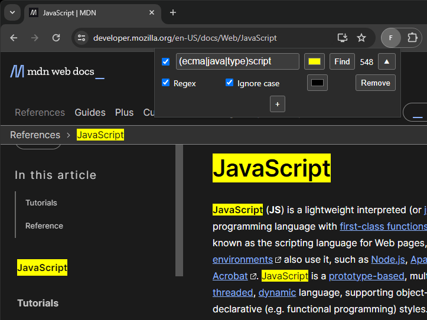
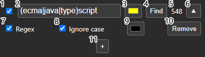

# FindRegex



## Features

- Find text on page using regular expressions
- Multiple independent queries can be added
- Highlight color for every query can be changed

## Options



1. Toggle for turning query highlighting off temporarily
2. Query field. Supports any valid JavaScript regular expression, or any string with regex mode turned off
3. Background color for highlighted text
4. Run query
5. Number of matches on page
6. Expand or collapse options
7. Toggle ignore case. Case is ignored by default.
8. Turn regex matching off for basic string matching with no special characters
9. Text color for highlighted text
10. Remove query, will remove its highlighting
11. Add a new query

## Tools Used
- [CRXJS](https://crxjs.dev/vite-plugin)
- [React](https://react.dev)
- [TypeScript](https://www.typescriptlang.org)
- [Vite](https://vitejs.dev)

## Developing

#### Run developement server
```
git clone https://github.com/antonpalviainen/find-regex.git
cd find-regex
npm run dev
```

#### Build
`npm run build`
